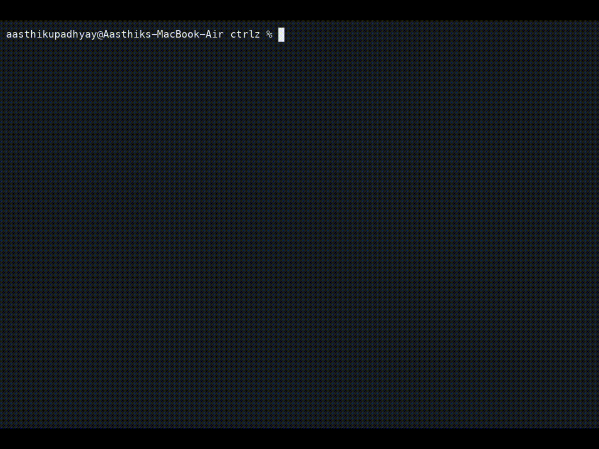

# ctrlz

**AI coding agents have already deleted family photos, wiped production databases, and taken down entire machines — in ordinary sessions where nobody expected it.**

ctrlz is the undo button for that: it sits underneath any agent (Claude Code, Cursor, Codex, Cline, Replit's agent, whatever you're running), takes automatic, zero-config snapshots of your working directory as it works, and gets you back to before, no matter what just happened.



## Why

The usual fixes are enterprise sandboxes and policy engines that require you to predict danger in advance. ctrlz doesn't predict anything. Not a sandbox, not a policy engine — it just makes sure nothing is ever truly gone.

## How it works

```
ctrlz watch -- claude-code
```

That's it. ctrlz snapshots your directory every few seconds while the agent runs, into a store that lives entirely outside the directory itself, so even a full `rm -rf` of the whole project can't touch your history.

If something goes wrong:

```
ctrlz undo
```

Everything reverts to the last snapshot. Files that were deleted come back. Files added since get cleaned up. Run `ctrlz undo` again and it undoes the undo, since the state right before you reverted gets snapshotted too.

```
ctrlz log     # see the timeline
ctrlz diff    # see exactly what changed
ctrlz status  # snapshot count, store size, whether watch is active
```

No config file. No policy to write. Doesn't need the directory to be a git repo. Works with any agent, because it never integrates with any agent, it just watches the filesystem underneath whatever's running.

## Install

**Prerequisites:** [Go](https://go.dev/dl/) 1.25+ and `git` on your `PATH` (ctrlz uses git purely as an internal storage engine — you never run git commands yourself).

```
go install github.com/Aasthik17/ctrlz/cmd/ctrlz@latest
```

Confirm it worked:

```
ctrlz --version
```

**Building from source instead**, e.g. to try an unreleased change:

```
git clone https://github.com/Aasthik17/ctrlz
cd ctrlz
make build
```

This cross-compiles binaries for macOS (arm64/amd64) and Linux (amd64/arm64) into `dist/`. Pick the one matching your machine and put it on your `PATH`. Prebuilt release binaries once this has real users.

## Commands

```
ctrlz watch -- <agent command>   # start protecting the current directory
ctrlz undo                       # revert to the last snapshot
ctrlz log                        # see the snapshot timeline
ctrlz diff <a> [b]               # see exactly what changed
ctrlz status                     # snapshot count, store size, whether watch is active
ctrlz init                       # register a directory without watching it yet
```

Every command takes an optional `path` (default: current directory), so day to day you'll run these with no arguments from inside the project. For what each flag does, worked examples, and a full walkthrough, see [`docs/USAGE.md`](docs/USAGE.md). For exact internal behavior — storage layout, the precise git plumbing, conflict edge cases — see [`docs/SPEC.md`](docs/SPEC.md).

## Status

This is v1: local filesystem protection on a single machine. It does not yet protect remote databases or API-driven destruction. That's a real, known gap and a planned next step, not a hidden one. See `docs/SPEC.md` for exactly what v1 does and doesn't cover.

## How it's built

The full technical design, including the exact git plumbing ctrlz uses underneath, is in `docs/SPEC.md`. The build roadmap is in `docs/IMPLEMENTATION_PLAN.md`.

## Contributing

See `docs/CONTRIBUTING.md`. Real failure reports from running ctrlz against an actual agent session are worth more right now than speculative features.

## License

MIT, see `LICENSE`.
